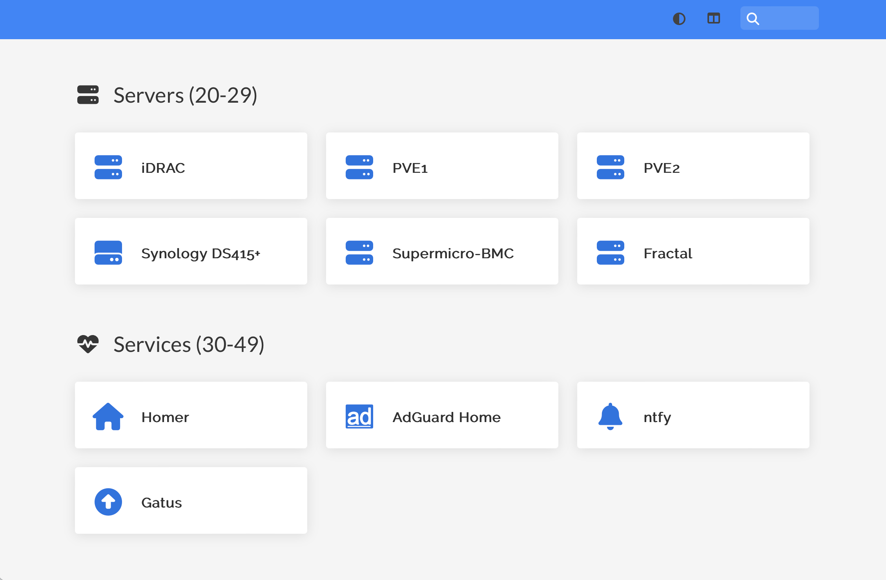
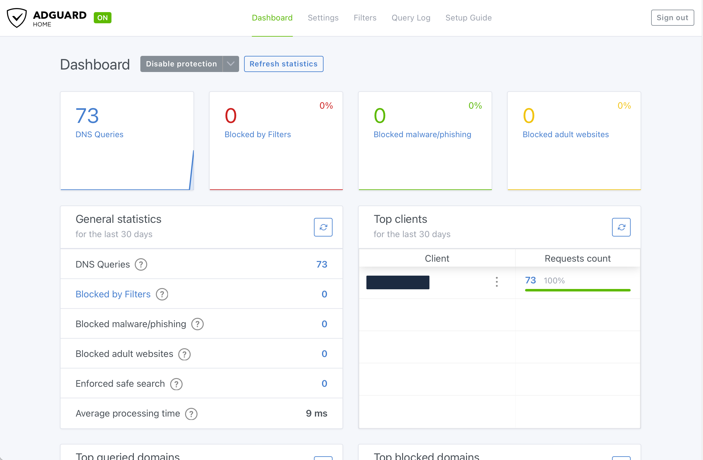
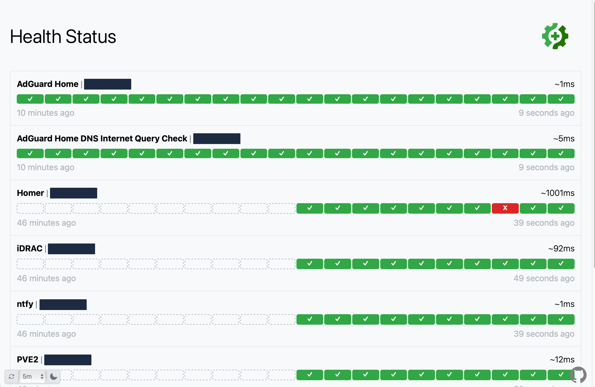
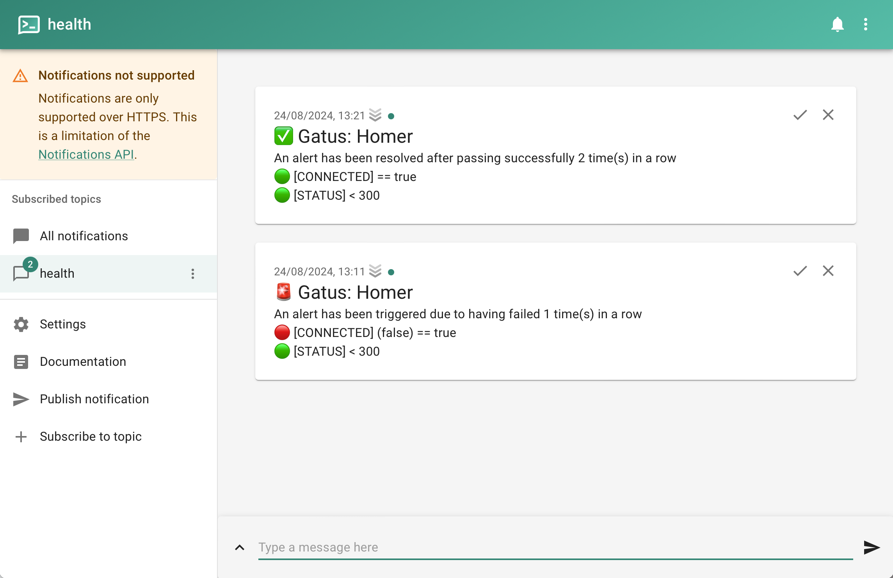

# HomeLab  <!-- omit in toc -->

This repository contains a collection of scripts and templates to help automate the deployment of various services in my home lab.

> [!NOTE]
> **Why have this home lab configuration public?**
>
> Well… I'd like to think that I have something to contribute to the community, and if my scripts are useful, I'd like to share them.
> Obviously, this will reveal how I'm configuring my home lab and network, but I would still like to share as much as possible.

- [Showcase](#showcase)
- [Prepare](#prepare)
  - [Your Host](#your-host)
  - [Proxmox Virtual Environment](#proxmox-virtual-environment)
- [Deploy](#deploy)
  - [VMs \& LXCs](#vms--lxcs)
  - [Services](#services)
- [Credits](#credits)

## Showcase






## Prepare

### Your Host

Create a `.env` file to store your sensitive variables.

```bash
cp .env.example .env
```

Update all the variables in the `.env` file you already know will need to be changed, like:

- `NETWORK_SHORT`
- `NETWORK_CIDR`
- `TF_VAR_IP_*` (Make sure they  on't overlap with your current network)
- `TF_VAR_SSH_PUBLIC_KEY`
- `ANSIBLE_TAILSCALE_TAILNET` (Head to your [Tailscale Admin > DNS](https://login.tailscale.com/admin/dns) to get your Tailnet name)
- `ANSIBLE_TAILSCALE_API_TOKEN_SECRET` (Head to your [Tailscale Admin > Settings > Keys](https://login.tailscale.com/admin/settings/keys) to get your API access token)
- `ANSIBLE_ADGUARDHOME_USERNAME`
- `ANSIBLE_ADGUARDHOME_PASSWORD`
- ...

Install the following tools on the device you will want to control the deployment from (e.g.: your laptop):

- [Terraform](https://developer.hashicorp.com/terraform/install)
- [Ansible](https://docs.ansible.com/ansible/latest/installation_guide/installation_distros.html)
- Ansible requirements: `ansible-galaxy install -r ./ansible/requirements.yml`

Add your SSH key to the Proxmox Virtual Environment:

```bash
ssh-copy-id -i ~/.ssh/id_rsa.pub root@<YOUR_PVE_ADDRESS>
```

### Proxmox Virtual Environment

Preparing the Proxmox Virtual Environment is automated by the following playbook, but in order for it to run it needs some environment variables.

So you need to run the following commands:

```bash
set -a ; source .env ; set +a
ansible-playbook -b ./ansible/playbooks/prep.yml
```

> [!IMPORTANT]
> Make sure you copy the Terraform API token from the playbook output and store it in your `.env` file.
> **It will only be displayed once!**

## Deploy

### VMs & LXCs

Now that our platform is ready, we can deploy the VMs and LXCs:

```bash
set -a ; source .env ; set +a
cd ./terraform
terraform init
terraform plan
terraform apply
```

> [!TIP]
> You can take down the infrastructure by running:
> - All the resources: `terraform destroy`
> - Only specific resources: `terraform destroy -target="module.<SERVICE_NAME>"`

### Services

Once the VMs and LXCs are up and running, we can deploy the services:

```bash
ansible-playbook -b ./ansible/playbooks/run.yml
```

> [!TIP]
> You might need to confirm the SSH fingerprint the first time you connect to a new host.
> You can do this either by:
> 1. Connecting to the host manually and confirming the fingerprint
> 2. Enter `yes` as **many times as the number of hosts you are connecting** to.
> 3. **TEMPORARILY** disable SSH fingerprint checking by modifying the `ansible.cfg` file to: `host_key_checking=False`

## Credits

I've tried to include most of the sources I've used directly in the files as a comment, usually at the top of the file with `Original Source: ...`.
But in the beginning of this project, I didn't write them down, so I might have missed some.
